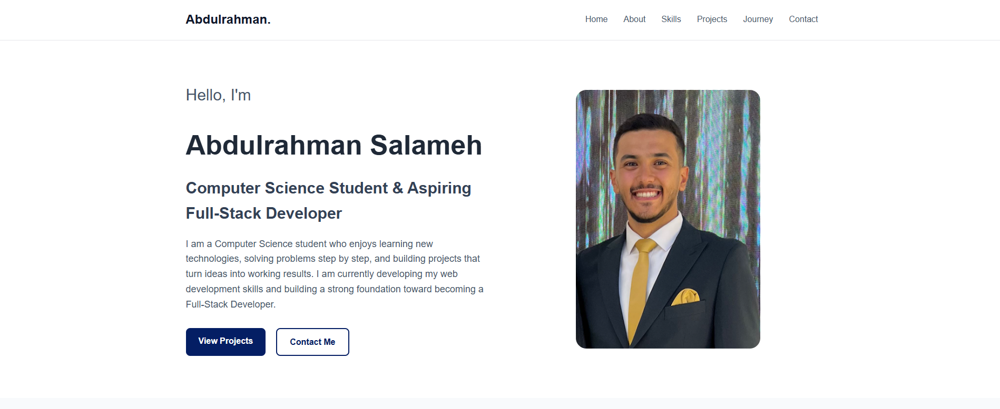

# Portfolio Website

## Abdulrahman Salameh

A responsive personal portfolio website created to showcase my skills, projects, learning journey, and contact information in a clean and modern design.

## Technologies Used

- HTML
- CSS

## Features

- Responsive design
- About section
- Skills section
- Projects showcase
- Learning journey
- Contact section
- GitHub and LinkedIn links

## Live Website

The live website link will be added here after deployment using GitHub Pages.

## Screenshot

## Author

Abdulrahman Salameh